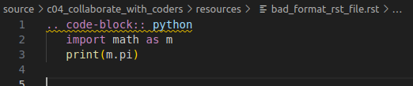
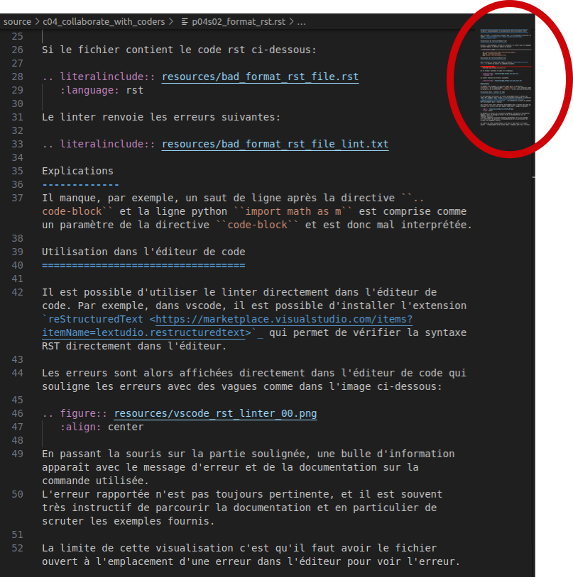
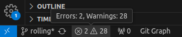
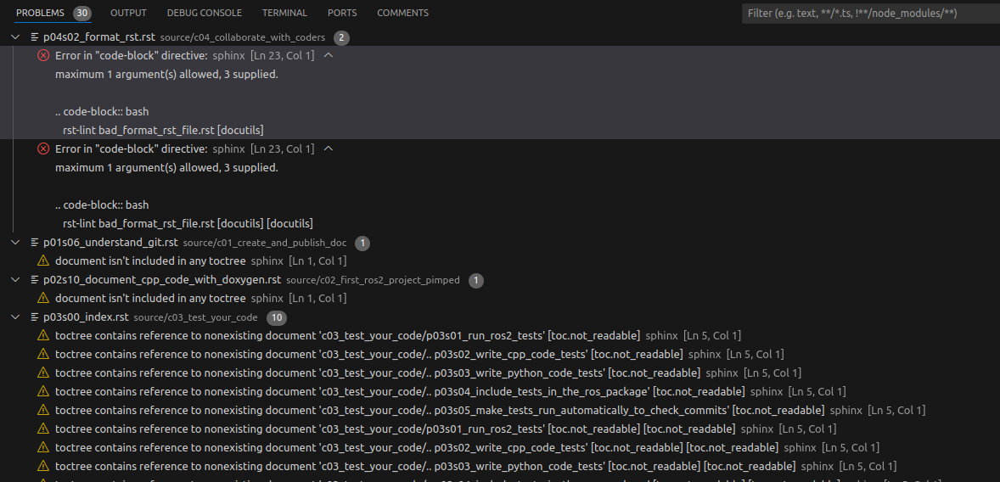

###############################################
Utilisation d'un linter dans l'éditeur de code
###############################################

*************************************
Installation d'un linter dans vscode
*************************************

Installation via une extension
===============================

Installation à la main (sans extension)
========================================

Créer une extension pour un linter
===================================

**********************
Visualisation directe
**********************

Les erreurs sont alors affichées directement dans l'éditeur de code qui souligne les erreurs avec des vagues comme dans l'image ci-dessous:

En passant la souris sur la partie soulignée, une bulle d'information apparaît avec le message d'erreur et de la documentation sur la commande utilisée.
L'erreur rapportée n'est pas toujours pertinente, et il est souvent très instructif de parcourir la documentation et en particulier de scruter les exemples fournis.

La limite de cette visualisation c'est qu'il faut avoir le fichier ouvert à l'emplacement d'une erreur dans l'éditeur pour voir l'erreur.

**********************
Visualisation minimap
**********************

Les erreurs apparaissent également comme des lignes en rouge dans la vue latérale ``minimap`` de vscode qui donne une vue d'ensemble du fichier. On peut activer cette vue en faisant un clic droit sur la barre de scrolling du fichier (à droite) et en checkant ``Minimap``.

**************************************
Visualisation dans la vue ``Problems``
**************************************

Les erreurs sont également listées dans la vue ``Problems`` de vscode. On peut y accéder 

   #. en cliquant sur l'icône en forme de triangle dans la barre de status de vscode souvent située en bas à gauche de la fenêtre.
   #. en ouvrant la vue de terminal en bas et sélectionnant l'onglet ``Problems``.

C'est la vue la plus intéressante car toutes les erreurs de tous les fichiers sont listées, avec un lien clickable pour se rendre directement à l'endroit de l'erreur dans le fichier.

***************************************
Visualiser la suggestion de formattage
***************************************

***************************************
Appliquer la suggestion de formattage
***************************************

**********************************************************************************
Automatiquement formater (sans vérification de l'utilisateur) à chaque sauvegarde
**********************************************************************************

**********************************************************
Que faire si une suggestion de formatage est incorrecte ?
**********************************************************