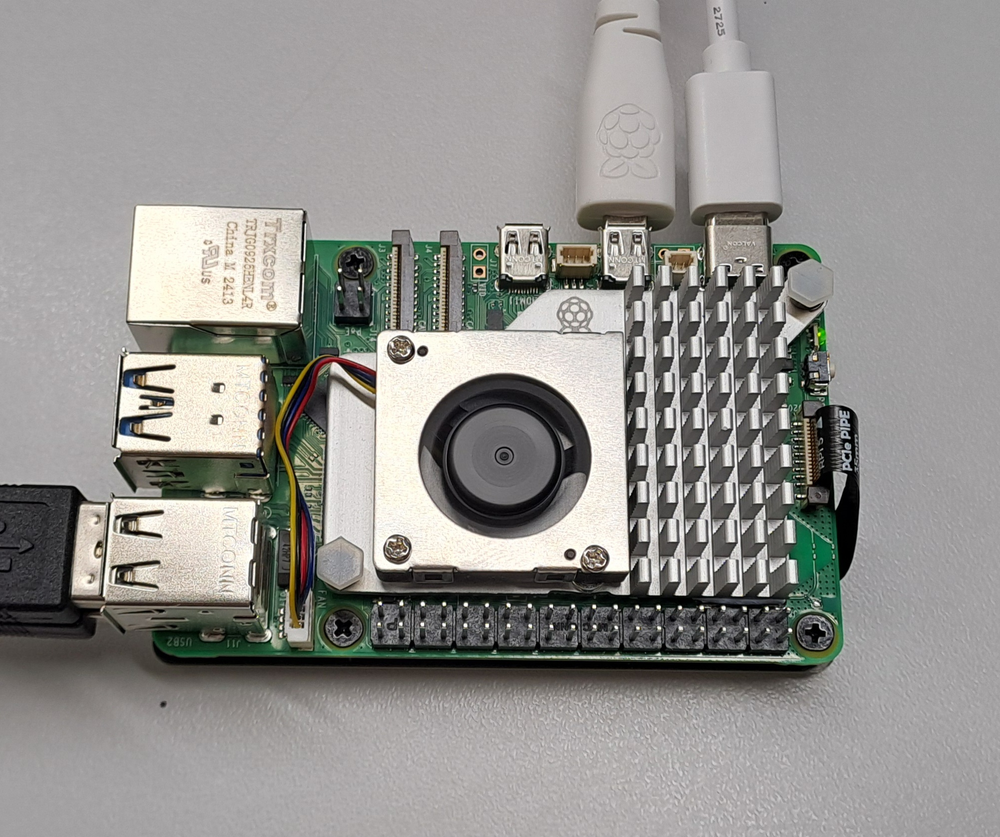
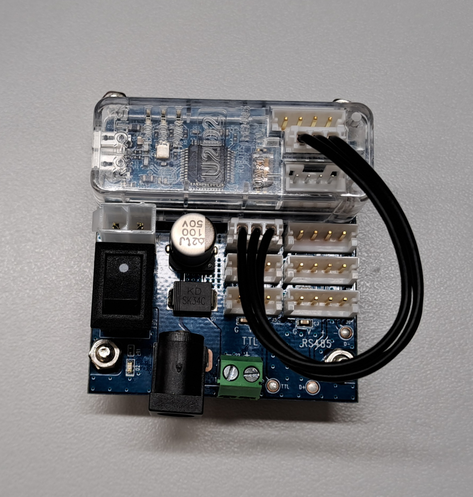
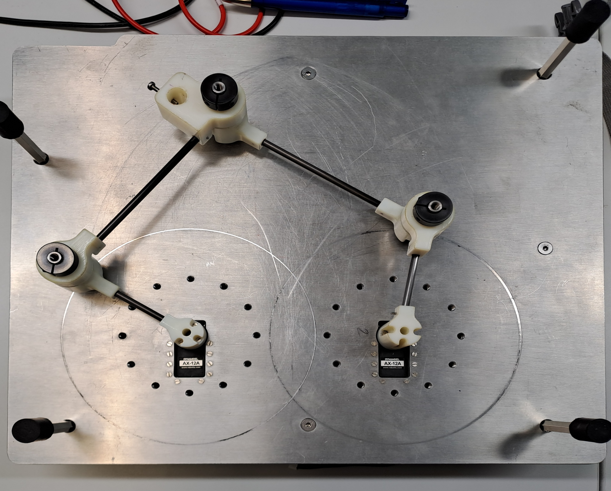

#####################################################
Description du matériel de la plateforme pantographe
#####################################################

Le but de ce projet est, comme il l'a été dis sur la page précédente, de mettre en mouvement un pentographe à l'aide de ROS2 tout en documentant la mise en oeuvre du projet. Ce projet va ainsi nous permettre de nous familiariser avec l'environnement ROS2 et de découvirir les bases de l'outil Git.

Pour mettre en oeuvre ce projet, nous aurons besoin du matériel suivant : 

* Une Raspberry Pi 5 : Ce premier élément est l'ordinateur de notre projet. C'est sur cette carte que le système Ubuntu et la plateforme ROS2 vont être installés, la carte va donc nous servir pour controller les moteurs sur la Dynamixel mais aussi à réaliser les différentes simulations.

* Une Dynamixel : Ce deuxième élément nous sert à mettre en mouvemement les moteurs du pentographe, ais aussi à récupérer l'état des moteurs, comme leur position ou leur vitesse.

* Un Pantographe : Ce dernier élément est le mécanisme que nous cherchons à mettre en mouvement à la fin du projet.

