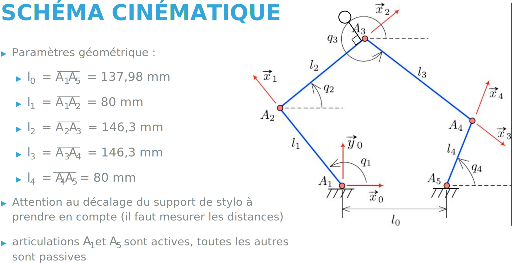

###################################################
Description mécanique de la plateforme pantographe
###################################################

Le pantographe peut être représenté avec le paramétrage suivant :  

Ce Paramétrage nous permet de mettre en place les équations régissant le Modèle Géométrique Direct (MGD) du pantographe :

Pour mettre en place ces équations, nous pouvons constater que chaqun des bras du pantographe ce déplace selon un disque de rayon maximal l1+l2 et l3+l4. Nous cherchons donc l'intersection des deux cercles de centre A2 et A4 et de rayon l2 et l4 respectivement. Le calcul de l'intersection des plans nous donne les équations suivantes : 

.. math::

   A_x = -l_5*sin(q_2)

   A_y = l_5*cos(q_2)

   x = l_2*cos(q_1) + l_4*cos(q_4) + A_x

   y = l_2*sin(q_1) + l_4*sin(q_4) + A_y

Avec :math:`l_5` le décalage du stylo.
