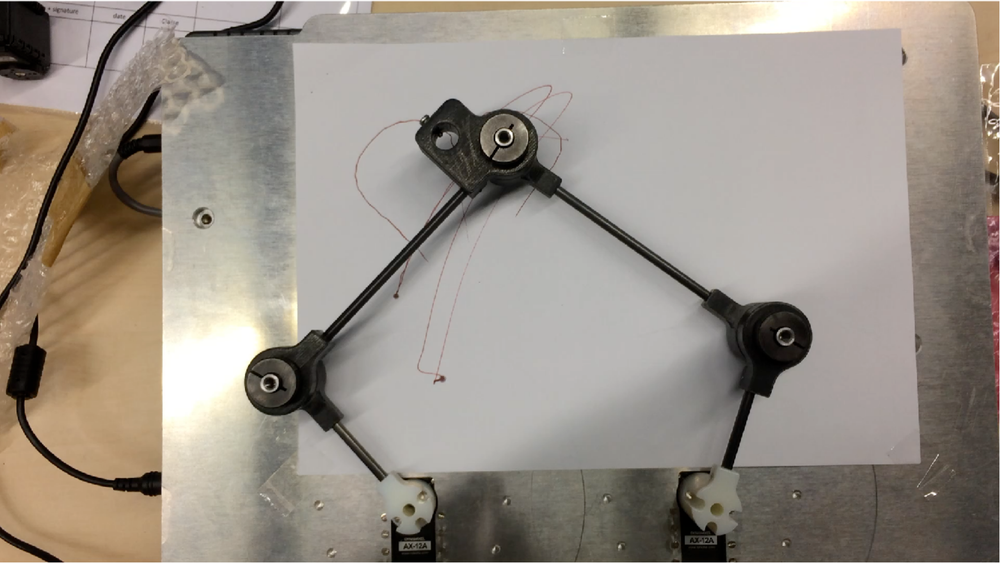

#########################################################
Pantographe de dessin robotisé avec Raspberry Pi et ROS2
#########################################################

.. toctree::
   :maxdepth: 2

   p50s01_material_description
   p50s02_mechanical_description
   p50s03_urdf

=====================
Description du projet
=====================

Pour ce travail pratique, vous allez installer une plateforme robotique ROS2 sur un Raspberry Pi (Pi5) et documenter le projet.
Le projet consiste donc à:

#. installer Ubuntu sur le Raspberry Pi, 
#. installer ROS2, 
#. tester et documenter les tests de l'installation système
#. Créer la rerprésentation mécanique du pantographe dans un fichier URDF
#. Créer un package ROS2 pour contrôler le pantographe
#. Créer des tests et documenter les tests
#. Tester en simulation avec Gazebo et RViz
#. Tester en réel avec le pantographe

La documentation correspondra à un fork de ce projet et sera publiée sur votre github.
Dans ce projet un canevas de documentation est fourni. Vous devrez le compléter et le publier.
Vous soumettrez votre travail sous forme de push request à ce projet.
