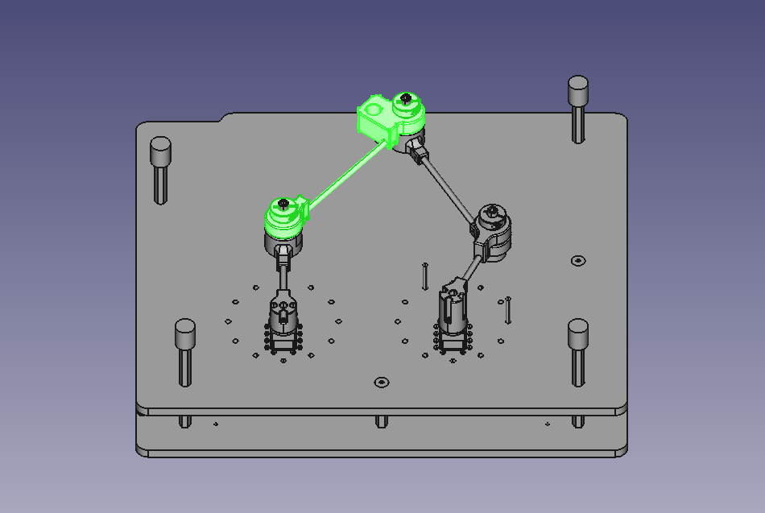

###################################################
 Génération de la description URDF du pantographe
###################################################

Nous allons utiliser le modèle 3D au format step conçu et réalisé par M. Olivier PICCIN pour générer la description URDF du pantographe.

Il s'agit d'un assemblage comportant 5 pièces principales :

  #. BATI_ASM: le bâti de la strucuture du pantographe avec les 2 moteurs pas à pas. Dans l'URDF nous allons le nommer ``base``.
  #. LINK1_ASM: le bras gauche du pantographe. Dans l'URDF nous allons le nommer ``link1``.
  #. LINK2_ASM: l'avant bras gauche du pantographe. Dans l'URDF nous allons le nommer ``link2``.
  #. LINK3_ASM: l'avant bras droit du pantographe. Dans l'URDF nous allons le nommer ``link3``.
  #. LINK4_ASM: le bras droit du pantographe. Dans l'URDF nous allons le nommer ``link4``.

:download:`maquette-5-barres_asm.stp <resources/cad/maquette-5-barres_asm.stp>`

Du point de vue URDF, nous aurons aussi besoin de définir l'outil de travail: le crayon et donc de le référencer par rapport à son support qui se trouve être sur l'avant bras gauche du pentographe (``link2``).

Dans un fichier URDF, les modèles 3D sont utilisés à partir de fichiers collada (extension .dae).
Il va donc falloir convertir notre modèle 3D au format step en un ensemble de 5 modèles 3D au format collada.

==================================
Extraction des modèles 3D en step
==================================

Pour extraire les modèles 3D au format step, vous pouvez utiliser le logiciel freecad.
   
   #. :download:`base.stp <resources/cad/base.stp>`
   #. :download:`link1.stp <resources/cad/link1.stp>`
   #. :download:`link2.stp <resources/cad/link2.stp>`
   #. :download:`link3.stp <resources/cad/link3.stp>`
   #. :download:`link4.stp <resources/cad/link4.stp>`

=====================================
Conversion des modèles 3D en collada
=====================================

Pour convertir les modèles 3D en collada (dae), vous pouvez utiliser le logiciel freecad.
   
   #. :download:`base.dae <resources/cad/base.dae>`
   #. :download:`link1.dae <resources/cad/link1.dae>`
   #. :download:`link2.dae <resources/cad/link2.dae>`
   #. :download:`link3.dae <resources/cad/link3.dae>`
   #. :download:`link4.dae <resources/cad/link4.dae>`

=========================
Création du fichier URDF
=========================

Dans un fichier URDF les modèles 3D sont référencés par des balises ``<mesh>``.